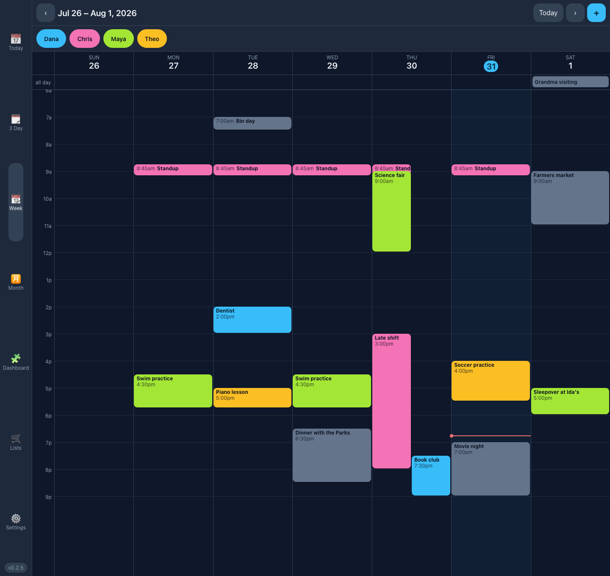
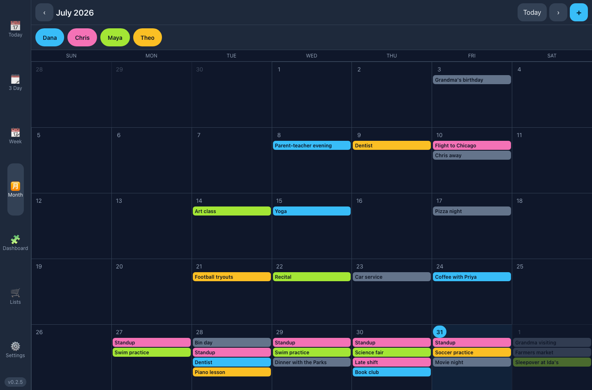
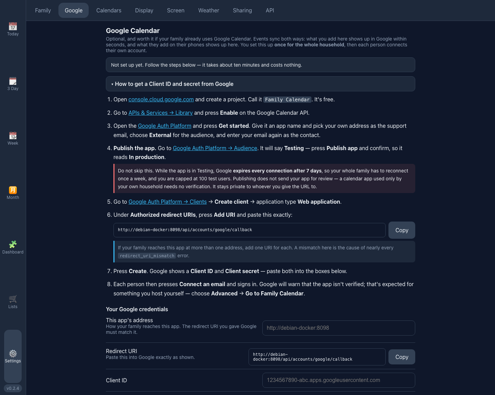
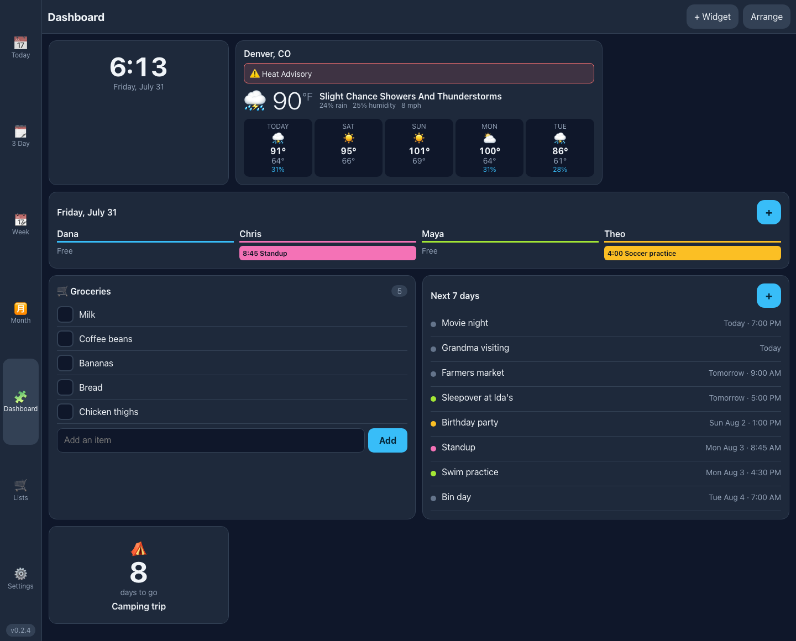
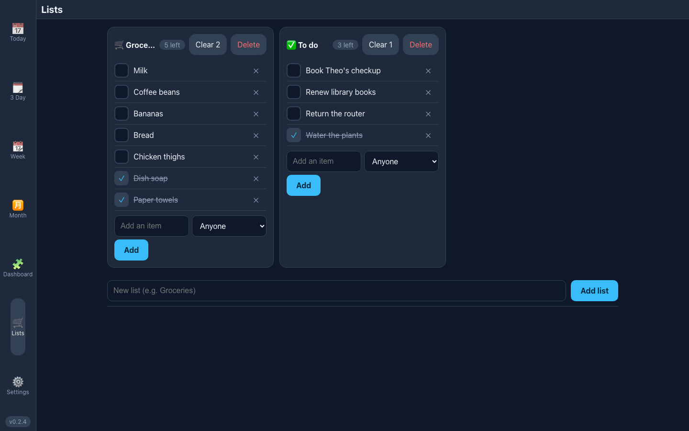
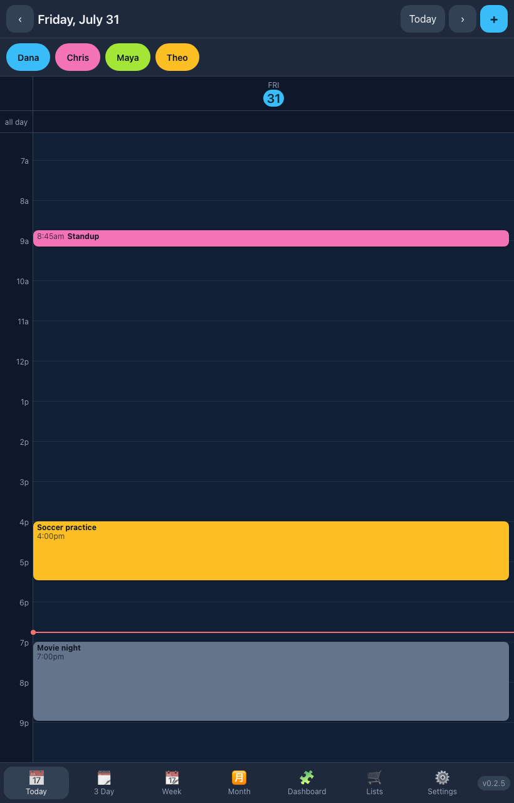

<div align="center">

# Mantel

### The open-source family calendar for your kitchen wall

**A self-hosted digital family calendar and command centre that runs on your own hardware.**
Real two-way Google Calendar and iCloud sync, a touchscreen-first interface for a wall-mounted
display,
shared grocery lists, weather, and a customisable dashboard — in one Docker container, with no
account, no subscription and no cloud.

A free, private alternative to Skylight Calendar, Hearth Display, Cozi and DAKboard.

[](LICENSE)
[](#running-on-a-raspberry-pi)
[](docs/kiosk-setup.md)
[](#security)



</div>

---

## Why this exists

Commercial family calendars — Skylight, Hearth, Cozi — are genuinely good products attached to
a subscription, a cloud account, and a camera-equipped screen in your kitchen that phones home.
The self-hosted alternatives mostly stop at *displaying* a calendar: they can show you what
Google already knows, but you can't add Tuesday's dentist appointment from the wall.

Mantel is the other thing. It is a calendar you **write to** from the wall, and everything you
write reaches everyone's phone.

**Two-way sync is the part that's rare**, and it works with **Google Calendar and iCloud**.
Add an event on the kitchen display and it appears on everyone's phones within seconds; change
it on a phone and it's on the wall at the next sync. Nextcloud can't do this at all — Google
requires OAuth, which Nextcloud's calendar subscriptions don't support. Home Assistant's CalDAV
integration can only create events, never edit or delete them. Mantel does the full round trip
for both services, including deletes and repeating events.

Mix them freely: the Google half of the family links Google accounts, the Apple half links Apple
IDs, and everyone's calendars sit side by side on the same wall.

## What you get

|                            |                                                                                        |
| -------------------------- | -------------------------------------------------------------------------------------- |
| 📅 **Four views**           | Today, 3-day, week and month — touch-first, portrait *and* landscape                     |
| 🎨 **A colour per person**  | Everyone links as many Google or Apple accounts as they like and claims the ones they own |
| 🔁 **Repeating events**     | Daily, weekly on chosen days, monthly, yearly — created on the wall, pushed as RRULEs    |
| 👤 **Filter by person**     | Tap a family member to grey them out; remembered per device                              |
| 🧩 **Dashboard wall**       | Build a screen from widgets: agenda, weather, lists, countdowns, clock, mini month       |
| 🛒 **Shared lists**         | Groceries and to-dos, tickable from any screen in the house                              |
| 🌤️ **Weather, no API key**  | National Weather Service in the US (with alerts), Open-Meteo everywhere else             |
| 📱 **Subscribe on a phone** | A read-only feed for Apple Calendar, Outlook or Google — and for Home Assistant          |
| 🔄 **Updates itself**       | Wall tablets hard-reload on their own when you deploy; nobody hunts for a refresh button |
| 🔌 **Works offline**        | Network drops and the display keeps showing the last known schedule instead of blanking  |
| 🖼️ **Photo screensaver**    | With burn-in protection and an overnight blackout window                                 |
| 🍓 **Runs on a Pi**         | Multi-architecture images for `amd64` and `arm64`                                        |
| 🤖 **Everything is an API** | Documented for humans *and* for AI agents                                                |

---

## Quick start

You need Docker. That's the whole list.

```bash
git clone https://github.com/heyitsmiike101/mantel.git
cd mantel
cp .env.example .env
./run.sh
```

Open <http://localhost:8080>.

That's a working family calendar already — a local "Family" calendar, four views, lists and a
dashboard. **Calendar sync is optional** and can wait until you feel like it.

To reach it from the other screens in the house, use the machine's LAN address instead, e.g.
`http://192.168.1.50:8080`.

**Prefer a prebuilt image?** Published for `amd64` and `arm64` on every release:

```bash
docker run -d --name mantel -p 8080:8080 \
  -v mantel-data:/data \
  -e SECRET_KEY="$(openssl rand -base64 32)" \
  ghcr.io/heyitsmiike101/mantel:latest
```

> **Before you connect anyone's account**, put a real `SECRET_KEY` in `.env`. It's the
> key your Google credentials, everyone's tokens and every iCloud app-specific password are
> encrypted with. The command to generate
> one is in the file.

---

## How to use it

### 1. Add your family

**Settings → Family.** Add everyone and give each person a colour. That colour is used for their
events everywhere — the grid, the dashboard, the filter chips.

Family members are just names and colours. Nobody has a password, because nobody logs in.

### 2. Add events

Tap the **+** in the top right, or tap any empty slot in the grid to start an event at that time.

- **All day** — flip the toggle; it renders as a banner across the top of the day
- **Repeats** — Never / Daily / Weekly on chosen days / Monthly / Yearly, with an optional end
  date. A repeating event is stored once and expanded for whatever range you're looking at.
- **Which calendar** — decides whose colour it gets, and whether it syncs to Google or iCloud

Editing a repeating event changes the whole series.

The **month** view is the one to leave up when you want the shape of the whole month rather than
the detail of a day:



### 3. Show only the people you care about

Every family member is a chip along the top of the calendar page (visible in the screenshot at
the top of this page), filled with their colour.
Tap someone to grey them out and hide their events; tap again to bring them back. **Show
everyone** resets it.

The choice is stored per device, so the kitchen display can show the whole family while your
phone shows only yours. Someone added to the family later shows up straight away rather than
arriving hidden, and events on a calendar nobody has claimed always stay visible — they belong
to the household.

### 4. Connect a calendar

Two services, both optional and independent. Connect either, both, or neither.

#### Google Calendar



**Settings → Google.** The page walks you through creating credentials in Google Cloud with
clickable links, shows the exact redirect URI for *your* installation with a copy button, and
takes about ten minutes. You do this **once for the whole household**.

Then each person presses **Connect an email** and signs in with their own account. Anyone can
connect several — a personal Gmail and a work Workspace account both work. Their calendars show
up underneath, where you choose who each one belongs to and switch **Syncing** on for the ones
you want on the wall.

**Nothing about Google goes in a config file**, and nothing needs a restart. There's a longer
written version at [docs/setup-google-oauth.md](docs/setup-google-oauth.md) if you'd rather read
ahead.

> ℹ️ **Google won't accept a LAN address as a redirect URI** — no IP addresses, no `.local` or
> `.lan`, no bare machine names, and plain `http://` only for `localhost`. The app checks your
> address and tells you before you go near the Google console. Three ways through it, all in
> [the setup guide](docs/setup-google-oauth.md#connecting-when-your-app-is-on-a-lan-address):
> connect once over an SSH tunnel using `localhost` (no infrastructure), run
> `tailscale serve` (one command, valid certificate, `.ts.net` is a public domain), or
> [point a subdomain you own at your reverse proxy](docs/setup-google-oauth.md#walkthrough-your-own-domain-private-network-valid-certificate)
> with a DNS-01 certificate — private to your network, and permanent.

> ⚠️ **Don't skip "Publish app"** in the Google Cloud console. An OAuth app left in *Testing*
> mode expires every family member's connection after 7 days. Publishing doesn't submit your app
> for review — it's step 4 of the in-app walkthrough, with an explanation.

#### iCloud

**Settings → Apple.** Much shorter, because there is **nothing to set up for the household** —
no developer account, no client ID or secret, no redirect URI, and none of the LAN-address
trouble above.

Apple has no OAuth for calendars, so each person makes an **app-specific password** at
[appleid.apple.com](https://appleid.apple.com) (Sign-In and Security → App-Specific Passwords)
and pastes it in with their Apple ID. It takes about a minute. The password is checked against
iCloud before anything is saved, so a typo tells you straight away instead of turning into a
sync that quietly never works, and it's stored encrypted.

Their calendars show up under **Settings → Calendars**, switched off, exactly like Google ones.
Longer version: [docs/setup-icloud.md](docs/setup-icloud.md).

> ℹ️ **An app-specific password isn't your Apple ID password.** It works only for this app and
> you can cancel it on its own at any time. Note that Apple cancels *all* of them whenever you
> change your real Apple ID password — the account will ask to be connected again, which is
> expected rather than a fault.

### 5. Build the dashboard



**Dashboard → Edit** and add widgets. Each has its own settings — how many days of weather, which
list, how far ahead the agenda looks.

| Widget              | What it shows                                          |
| ------------------- | ------------------------------------------------------ |
| Today by person     | One column per family member, in their colour          |
| Upcoming events     | A running list of what's next, with add/remove buttons |
| Weather             | Current conditions and the days ahead                  |
| Shared list         | A grocery or to-do list you can tick off from the wall |
| Countdown           | "Camping trip — in 12 days"                            |
| Clock / Mini month  | For glancing at from across the room                   |

This is usually the right screen to leave a wall display sitting on.

### 6. Shared lists



**Lists.** Groceries, chores, packing lists — anyone in the house can tick things off from any
screen. Checked items sink to the bottom, and **Clear checked** empties them. Put a list on the
dashboard and the wall becomes the shopping list.

There are no private lists. Everything here is shared by the household, which is the point.

### 7. Weather

**Settings → Weather.** Search for your town — you don't need to find coordinates, and there's
no API key or account. In the United States it uses the National Weather Service, including
watches and warnings; everywhere else it uses Open-Meteo.

If the forecast service is unreachable, the last good forecast keeps showing with a *stale*
marker rather than the panel going blank.

### 8. Put it on the wall



1. **Settings → Display** → set text size to **wall** so it's readable from across the room.
2. Point the tablet's browser at the app and put it in kiosk / full-screen mode.
3. Pick the route it should sit on — `/dashboard` or `/calendar/week` are the usual choices.
4. **Settings → Screen** → upload photos for the screensaver and set an overnight blackout.

The screen keeps itself current: data refreshes every minute, and when you deploy a new version
every open page hard-reloads itself within a minute. The running version is always visible in the
corner of the navigation bar.

**→ [docs/kiosk-setup.md](docs/kiosk-setup.md)** covers this properly: Chromium kiosk mode on a
Raspberry Pi, Fully Kiosk on Android, Guided Access on an iPad, how to actually turn the screen
off at night (the command most tutorials still give you stopped working in Raspberry Pi OS
Bookworm), and how to stop a permanently-charging wall tablet's battery from swelling.

### 9. Get it on everyone's phone

**Settings → Sharing** gives you a read-only calendar feed. Subscribe to it in Apple Calendar,
Outlook or Google and the family calendar appears alongside everything else on the phone, no app
to install.

The same feed is the **Home Assistant** integration: pair it with the push-refresh setting and a
calendar entity in HA updates within a second instead of once a day, with no custom component.
See [docs/sharing-and-home-assistant.md](docs/sharing-and-home-assistant.md).

---

## Running on a Raspberry Pi

The image is built for `linux/amd64` and `linux/arm64`, so a Pi 4 or Pi 5 runs the same tag as a
desktop, and `./run.sh` works unchanged.

You can also keep the Pi dumb: run the container on a NAS or server and let the Pi be nothing but
a browser pointed at it. That's lighter, and an SD card failure then costs you nothing.

To build the multi-architecture image yourself:

```bash
./build.sh --push ghcr.io/yourname/mantel
```

On an x86 machine, QEMU needs registering once for the arm64 half:

```bash
docker run --privileged --rm tonistiigi/binfmt --install arm64
```

## Upgrading

```bash
git pull
./run.sh
```

Every open screen in the house picks up the new version within a minute — no refreshing, no
walking around with a keyboard. Database changes are applied at startup, so upgrading never needs
a manual migration step.

## Configuration

**Almost everything is configured in the app, under Settings**, with the instructions on the page:
Google Calendar, weather, the screensaver, sharing links, Home Assistant. You don't edit files and
restart containers to finish setting this up.

`.env` holds only what has to exist before the app starts:

| Variable     | Default              | What it does                                            |
| ------------ | -------------------- | ------------------------------------------------------- |
| `PORT`       | `8080`               | Port the app is served on                               |
| `SECRET_KEY` | *(insecure default)* | Encrypts your Google credentials, tokens and iCloud passwords — set yours |

Optional tuning (sync intervals, database URL, CORS) is there too with sensible defaults, and
every option is documented in **[docs/configuration.md](docs/configuration.md)**.

## The API

Every feature in the UI is backed by an endpoint, so you can wire the calendar into anything else
you run at home. It's all collected in the app under **Settings → API**.

- **Interactive docs:** `/api/docs`
- **Schema:** `/api/openapi.json`
- **Guide written for AI agents:** `/api/ai-guide` — also readable at [docs/ai-guide.md](docs/ai-guide.md)
- **Changing the code, human or AI:** [AGENTS.md](AGENTS.md) — the constraints that aren't
  obvious from any one file

```bash
# What's on this week?
curl "http://localhost:8080/api/events?start=2026-08-02T00:00:00Z&end=2026-08-09T00:00:00Z"

# Add something
curl -X POST http://localhost:8080/api/events \
  -H 'Content-Type: application/json' \
  -d '{"calendar_id":1,"title":"Dentist","start_at":"2026-08-05T14:00:00Z","end_at":"2026-08-05T15:00:00Z"}'
```

Because there's a complete API and a guide written for LLMs, "add everything on this school
newsletter to the calendar" is a thing an agent can actually do.

## Security

There is **no authentication**, deliberately. A wall calendar that asks a ten-year-old to log in
before adding football practice doesn't get used, and this is designed to live behind your front
door.

That means: **don't expose it directly to the internet.** If you need access from outside the
house, put it behind a VPN — Tailscale and WireGuard both work well. The one exception is the
`/api/feeds/*.ics` links, which carry a token, because a feed URL is the thing most likely to be
pasted into a service outside the house.

Secrets you give it (the Google client secret, Home Assistant token) are encrypted at rest with
your `SECRET_KEY` and are never readable back out through the API.

## Data and backups

Everything lives in one SQLite database inside the `mantel-data` Docker volume:

```bash
docker run --rm -v mantel-data:/data -v "$PWD":/backup alpine \
  cp /data/family.db /backup/family-backup.db
```

SQLite runs in WAL mode, so every screen in the house can read while somebody is editing, and
concurrent edits queue rather than fail. That's plenty for a family. If you ever want something
heavier, point `DATABASE_URL` at Postgres — no code changes needed.

> **Don't put the database on a cloud-synced folder** (OneDrive, Dropbox, iCloud). Their
> file-locking behaviour can corrupt SQLite. The default Docker volume is safe.

## FAQ

**Do I need a Google account?**
No — and if you're an Apple household you can skip Google entirely and connect iCloud instead,
which takes about a minute per person and needs no developer account. Everything except calendar
sync works with no external account at all — including weather,
which needs no API key.

**Does it work on a phone?**
Yes. The layout is responsive and installs to a home screen as a PWA.

**Can two people edit at the same time?**
Yes. SQLite is in WAL mode with a busy timeout, and there are tests covering concurrent writes
from many screens at once.

**What happens when my internet drops?**
The wall display keeps showing the last known schedule with an offline banner. Changes you make
while offline aren't queued — that's on the roadmap.

**Can I use it without a wall display?**
Sure. It's a perfectly good family calendar in a browser tab. The wall is just where it's best.

**How is this different from DAKboard or MagicMirror?**
Those are display frameworks — they render information beautifully but are read-only. Mantel is a
calendar you write to, with Google and iCloud sync in both directions.

## Development

```bash
# Backend
cd backend
uv venv --python 3.12 .venv && uv pip install --python .venv -e ".[dev]"
DATABASE_URL="sqlite:///../data/family.db" .venv/bin/uvicorn app.main:app --reload --port 8080
.venv/bin/python -m pytest

# Frontend (proxies /api to :8080)
cd frontend
npm install
npm run dev
npm test
```

Contributions welcome. There's a backlog in [CHANGELOG.md](CHANGELOG.md) of what's deliberately
not built yet — chores and rewards, meal planning, CalDAV, drag-to-move events.

## License

MIT — see [LICENSE](LICENSE). Do what you like with it.
